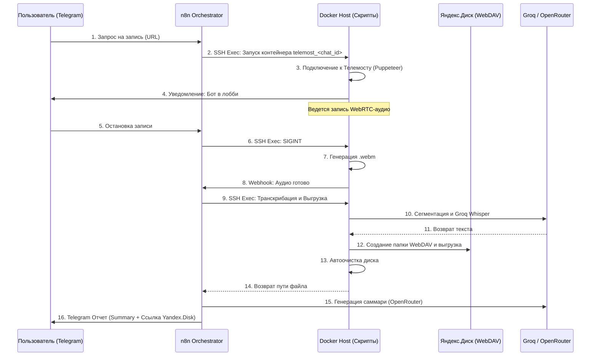

# Telemost Recorder Core (Zero-Cost Bot)


Автономный ИИ-ассистент для записи встреч Яндекс.Телемост с **нулевыми операционными затратами** (ZeroPay). Бот подключается к конференциям, перехватывает WebRTC-потоки, транскрибирует аудио, выгружает результаты на Яндекс.Диск и генерирует структурированные саммари встреч через интерфейс Telegram.

## 🚀 Философия и Ключевые особенности

1. **Headless WebRTC Injection**: Запись аудио осуществляется путем перехвата аудиопотоков из `RTCPeerConnection` непосредственно в изолированном Puppeteer-контейнере.
2. **Whisper-Friendly Chunking**: Интеллектуальное дробление аудиофайлов (FFmpeg) на чанки по 20 минут для обхода лимитов внешних API транскрибации (Groq Whisper 25 MB).
3. **Storage Self-Cleaning**: Гарантированное удаление локальных временных файлов и чанков с хоста после завершения работы.
4. **Интеграция с Яндекс.Диском (WebDAV)**: Полностью автоматическое сохранение медиафайлов и текстов в персональное облако пользователя (`Yandex.Telemost.Records/[Дата]_[Тема_от_ИИ]/`).
5. **Multi-User Isolation**: Запуск независимых, полностью изолированных Docker-контейнеров (`telemost_<chat_id>`) для поддержки одновременной записи нескольких встреч от разных пользователей.
6. **n8n Orchestration & FSM**: Управление всеми процессами, интерфейсами пользователя в Telegram и запросами в базу данных PostgreSQL инкапсулировано в воркфлоу n8n.

---

## 🗺 Архитектура системы

Система разделена на исполнительный слой (Docker-воркер на хост-сервере) и оркестрирующий слой (n8n).



---

## 📱 Telegram-интерфейс (UX)

Управление сервисом осуществляется через Telegram-бота, построенного как конечный автомат (FSM) с хранением состояний в PostgreSQL:

- **🔴 Запись встреч**: Режим ожидания ссылки (Force Reply). Бот автоматически подключается после получения ссылки.
- **🧠 Аналитика и ИИ**: Запуск ручной транскрибации, саммаризации или вывод списка последних 5 встреч (с ИИ-названиями).
- **⚙️ Настройки**: Настройка учетных данных Яндекс.Диска (логин + пароль приложения) прямо из мессенджера (без ручной конфигурации сервера).

---

## 📦 Развертывание и Настройка

### 1. Подготовка Сервера
Для хост-сервера необходимы: **Docker**, **Node.js (v20+)** и **FFmpeg**.
```bash
git clone https://github.com/3dstepansky/stepansky-telemost-recorder-doker.git
cd stepansky-telemost-recorder-doker
npm install
docker build -t stepansky-telemost-recorder:latest .
```

### 2. Конфигурация (.env)
Создайте `.env` файл на сервере:
```ini
# Отображаемое имя бота на встрече
BOT_DISPLAY_NAME="Бот-Ассистент"

# API Ключи
GROQ_API_KEY=gsk_...

# Лимиты
MAX_IDLE_MINS=3
MAX_DURATION_MINS=180
HEADLESS=true
```
*(Учетные данные Яндекс.Диска безопасно вводятся самими пользователями в интерфейсе Telegram).*

### 3. Настройка Оркестратора (n8n)
- Подключите Telegram-бота, SSH-ключ к вашему хост-серверу, базу данных PostgreSQL и OpenRouter (для саммари) через настройки Credentials в n8n.
- Импортируйте воркфлоу, чтобы активировать логику FSM и обработку вебхуков.

---

## 🎯 План Развития (Roadmap / v2)

- 🔴 **Diarization**: Разделение реплик по спикерам (замена базовой метки "Спикер").
- 🔴 **Real-Time AI Chat**: Интерфейс во время записи, позволяющий задавать вопросы боту по контексту обсуждаемого материала на лету.
- 🔴 **Archival Q&A**: Чат-сессия для ответов на вопросы по историческим (ранее записанным) встречам, загружаемым с Яндекс.Диска.
