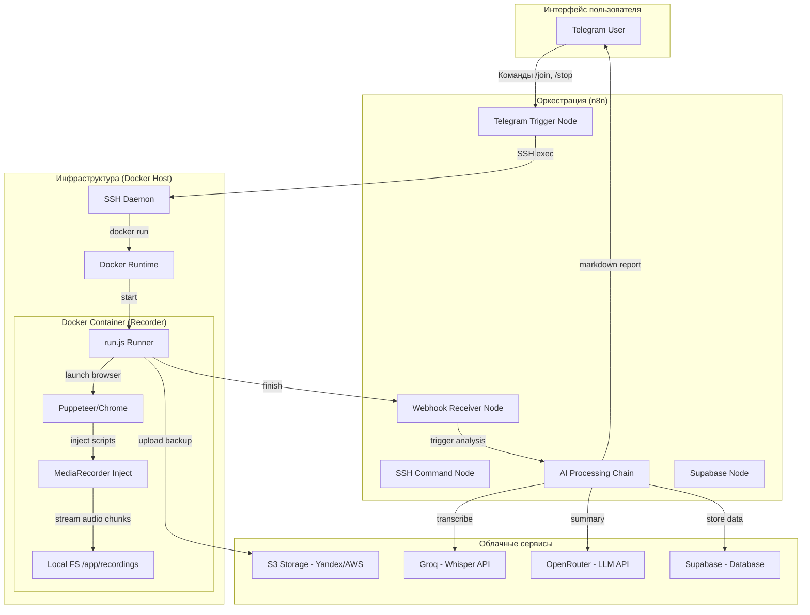
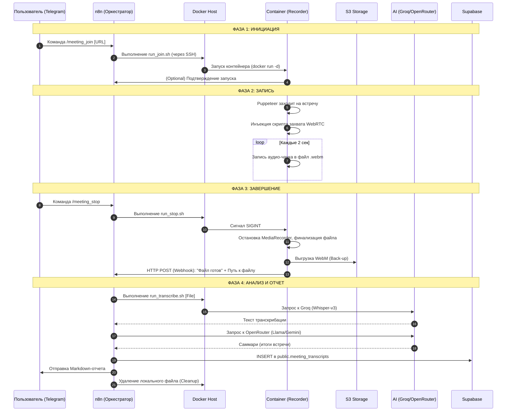

# Stepansky Telemost Recorder (Docker Edition) v0.002

Автономный ИИ-рекордер для Яндекс.Телемост, работающий в Docker-контейнере. Позволяет не только записывать встречи, но и автоматически очищать их от тишины, делить на части и превращать в текст с помощью ИИ.

## 🚀 Основные достижения (v0.002)

1.  **Autonomous Pipeline**: Полный цикл «Запись -> VAD (очистка тишины) -> Транскрибация (Whisper-v3) -> Саммари (Llama-3)».
2.  **Smart VAD (Voice Activity Detection)**: Автоматическое удаление тишины из записи через FFmpeg, что экономит до 50% места и токенов.
3.  **Auto-Segmentation**: Интеллектуальное дробление аудио на 20-минутные чанки для обхода лимитов Groq API (25MB).
4.  **Autonomous Exit (Lonebot)**: Бот сам понимает, когда встреча закончена — он уходит, если остался один в комнате 3 минуты.
5.  **Ghost Bypass 2.0**: Улучшенная инъекция имени, гарантирующая вход под именем "Бот-Ассистент".

## 🛠 Требования
- Docker / Docker Compose
- API Ключ Groq (бесплатно на console.groq.com)

## 📦 Быстрый старт

1.  Клонируйте репозиторий.
2.  Создайте файл `.env`, впишите ваш `GROQ_API_KEY`.
3.  Запустите запись одной командой:
    ```bash
    docker-compose run --rm recorder "ВАША_ССЫЛКА_НА_ТЕЛЕМОСТ"
    ```

## 🗺 Дорожная карта (Roadmap)
- [x] Milestone 3: Интеграция с Groq API для автоматической транскрибации.
- [x] Milestone 4: Генерация кратких итогов встречи (Summary) через Llama 3.
- [ ] Milestone 5: Автоматическая загрузка записей в S3-облако (Яндекс.Облако).

---
**Разработано для серьезной автоматизации бизнес-процессов.**

---

# Спецификация системы

## 1. Концепция и Философия
Создание профессионального инструмента для записи и анализа встреч с **нулевыми операционными затратами** (ZeroPay). Использование Open Source решений (n8n, Puppeteer, Docker) и Free Tier лимитов ИИ-сервисов (Groq, OpenRouter, Supabase).

### Ключевые особенности
1. **Zero Zombie**: Контейнер-воркер гарантированно удаляется после завершения записи.
2. **Auto-Exit**: Бот автоматически выходит из встречи и не тратит ресурсы хоста, если все участники покинули лобби.
3. **Clean Disk**: Локальные временные файлы и чанки полностью удаляются с сервера сразу после успешной выгрузки в облако и выполнения анализа.

---

## 2. Архитектурная схема (C4-Style)



---

## 3. Детальный сценарий работы (Sequence Diagram)



### 3.1. Детализация процесса Puppeteer (Микро-шаги входа и записи)
Во время взаимодействия с веб-интерфейсом Яндекс.Телемост Puppeteer-рекордер выполняет следующие последовательные действия:
1. **Ожидание селектора**: Бот ожидает появления элемента «Продолжить в браузере» на стартовой странице встречи.
2. **Вход**: Выполняет клик по кнопке входа в качестве гостя.
3. **Идентификация**: Находит поле ввода и вводит имя ассистента (`BOT_DISPLAY_NAME`).
4. **Конфигурация медиа**: Инициирует клик «Выключить микрофон» и «Выключить камеру» во избежание помех для участников.
5. **Подключение**: Кликает кнопку «Присоединиться» для входа во встречу.
6. **Захват звука**: Выполняет инъекцию скрипта перехвата WebRTC аудио-треков участников и начинает циклическую запись base64 чанков в локальный WebM-файл.
7. **Мониторинг**: Каждые 10 секунд выполняет DOM-запрос количества участников. Если в лобби остается только бот, запускает таймер автоматического выхода (3 минуты).

---

## 4. Пользовательский сценарий (User Journey)

| Шаг | Действие пользователя | Реакция системы | Технический статус |
| :--- | :--- | :--- | :--- |
| **1. Настройка** | Вводит `/telemost_name Ассистент` | Бот сохраняет имя для входа в лобби | Готово |
| **2. Старт** | Вводит `/meeting_join [URL]` | Бот пишет: "Запись запущена" | Готово |
| **3. Встреча** | Проводит митинг | Бот висит в списке участников (без звука/видео) | Готово |
| **4. Стоп** | Вводит `/meeting_stop` | Бот пишет: "Завершаю, начинаю анализ..." | Готово |
| **5. Ожидание** | Ждет 30-60 секунд | — | В процессе |
| **6. Финиш** | Получает сообщение с текстом и итогами | Присылает структурированный Markdown | В процессе (n8n) |

---

## 5. Карта реализации и Проблемные зоны (GAP Analysis)

### 🟢 Реализовано (Стабильно):
- **Инъекция Puppeteer**: Надежный захват аудио через monkey-patching RTCPeerConnection.
- **Управление через n8n**: Полноценный воркфлоу с обработкой команд Telegram.
- **Docker-изоляция**: Рекордер не зависит от ОС сервера.

### 🟡 В процессе (Требует доработки):
- **S3 Интеграция**: Скрипт `s3.js` существует, но логика в `run.js` не обрабатывает ошибки загрузки. В n8n ссылки на S3 не прокидываются.
- **Транскрибация длинных встреч**: При файле > 25MB Groq выдаст ошибку. Нужна сегментация.
- **Очистка диска**: Нет автоматического удаления `.webm` после успешного завершения пайплайна.

### 🔴 Не реализовано (Будущие итерации):
- **Diarization**: Определение имен спикеров (сейчас все — "Спикер").
- **Загрузка видео**: Сейчас пишется только аудио (для экономии ресурсов).
- **Экспорт в PDF/Docx**: Сейчас только текст в Telegram.

---

## 6. Итерационный план развития

### Итерация 1: Стабилизация S3 и Транскрибации
- Настройка реальных ключей S3 в `.env`.
- Добавление `ffmpeg` в Docker-образ для проверки целостности файла перед отправкой.
- Внедрение удаления локального файла в n8n после сохранения в БД.

### Итерация 2: Поддержка длинных сессий
- Модификация `run.js`: если файл > 20 минут, дробить его на части.
- Модификация `transcribe.js`: поддержка обработки списка файлов (batch processing).

### Итерация 3: Интеллектуальный Саммари
- Улучшение системного промпта в n8n для выделения задач (Action Items).
- Интеграция с Google Calendar (опционально).
