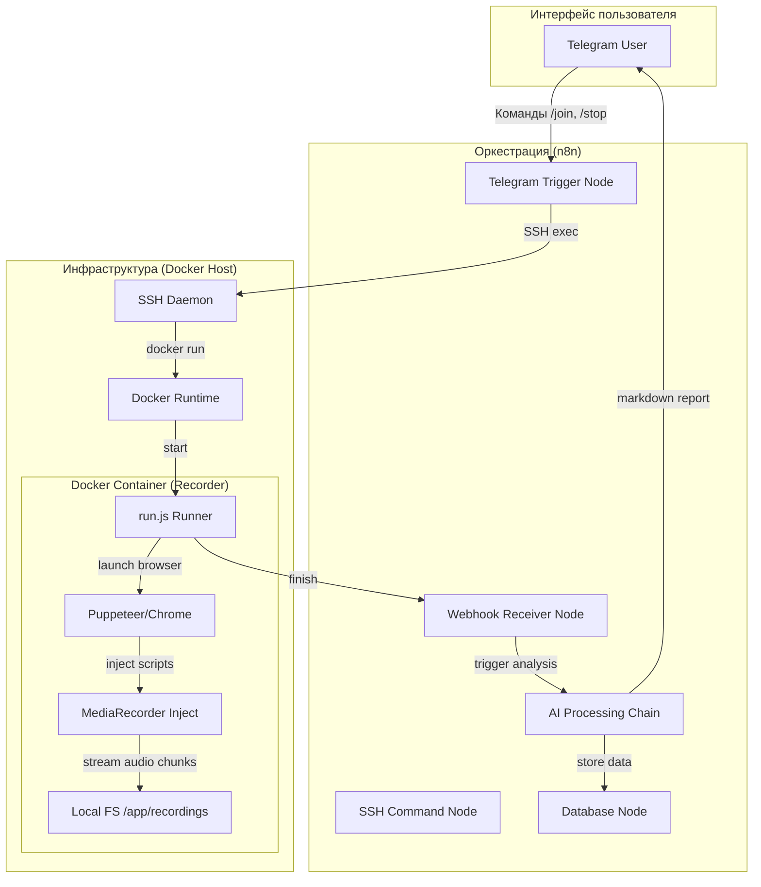

# Stepansky Telemost Recorder (Docker Edition) v0.003

Автономный ИИ-рекордер для встреч Яндекс.Телемост с **нулевыми операционными затратами** (ZeroPay). Позволяет записывать встречи, автоматически делить аудио на сегменты, выгружать в облако (Яндекс.Диск) и превращать в текст с помощью ИИ (Groq Whisper-v3), а затем генерировать краткое содержание встречи (Llama/Gemini).

## 🚀 Философия и Ключевые особенности

1. **Zero Zombie**: Контейнер-воркер гарантированно удаляется после завершения записи.
2. **Auto-Exit**: Бот автоматически выходит из встречи и не тратит ресурсы сервера, если все участники покинули лобби.
3. **Clean Disk**: Локальные временные файлы и чанки полностью удаляются с сервера сразу после успешной выгрузки аудио и текста на Яндекс.Диск по WebDAV.
4. **Autonomous Pipeline**: Полный цикл «Запись -> Выгрузка -> Транскрибация (Whisper-v3) -> Саммари -> Telegram».
5. **Auto-Segmentation**: Интеллектуальное дробление аудиофайлов через FFmpeg (на чанки по 20 мин) для обхода лимитов Groq API (25MB).
6. **Ghost Bypass 2.0**: Инъекция имени, гарантирующая вход под заданным именем (например, "Бот-Ассистент").

---

## 📦 Быстрый старт и локальная отладка

### 1. Подготовка окружения
Перейдите в директорию проекта и установите зависимости:
```bash
npm install
```
*Убедитесь, что в системе установлен **FFmpeg** и он добавлен в системную переменную `PATH`.*

### 2. Конфигурация переменных окружения (`.env`)
Создайте файл `.env` в корне проекта (`stepansky-telemost`) со следующими ключами:
```ini
# Ключ авторизации Groq Whisper API (для транскрибации)
GROQ_API_KEY=gsk_...

# Настройки Яндекс.Диска WebDAV (для бэкапа файлов)
YANDEX_USER=your_yandex_login
# Пароль приложения (генерируется в Yandex ID -> Безопасность -> Пароли приложений)
YANDEX_WEBDAV_PASSWORD=your_app_password

# Адрес вебхука n8n для отправки уведомлений об окончании записи
N8N_WEBHOOK_URL=https://...

# Настройки отображения бота в лобби
BOT_DISPLAY_NAME=Тест-Ассистент
MAX_IDLE_MINS=1
MAX_DURATION_MINS=180

# Режим отладки Puppeteer (true = скрыто (headless), false = открыть окно Chrome)
HEADLESS=false
```

### 3. Локальный запуск
Для запуска записи встречи и проверки прохождения лобби выполните:
```bash
node run.js "https://telemost.yandex.ru/j/..."
```
Если `HEADLESS=false`, вы сможете наблюдать за действиями бота (ввод имени, выключение микрофона/камеры, вход). После завершения встречи (или ручного закрытия окна браузера) аудиозапись сохранится в `recordings/` и начнётся выгрузка на Яндекс.Диск.

### 4. Тестирование транскрибации
Для проверки ИИ-транскрибации на любом тестовом `.webm` файле:
```bash
node transcribe.js "path/to/meeting_audio.webm" "Тестовая встреча" "12345"
```
Скрипт выполнит сегментацию через FFmpeg (при необходимости) и выведет структурированный JSON-ответ с текстом.

---

## 🗺 Архитектура и n8n Оркестрация

Система концептуально разделена на исполнительный Node.js-клиент (Puppeteer-бот внутри Docker, управляемый через SSH) и оркестрирующий воркфлоу **n8n**, который управляет логикой Telegram-бота, базой данных (PostgreSQL/Supabase) и ИИ-аналитикой (OpenRouter).



### Детализация процесса входа бота (Puppeteer):
1. **Ожидание селектора**: Бот дожидается кнопки «Продолжить в браузере».
2. **Вход**: Переход на страницу гостевого входа.
3. **Идентификация**: Ввод имени ассистента из переменной `BOT_DISPLAY_NAME`.
4. **Конфигурация медиа**: Автоматическое отключение камеры и микрофона для предотвращения шумов (эхо-эффектов).
5. **Подключение**: Клик по кнопке «Присоединиться».
6. **Захват звука**: Инъекция в WebRTC API для перехвата аудио-треков участников и циклическая запись base64 чанков в `.webm` файл.
7. **Мониторинг тишины**: Раз в 10 секунд бот проверяет количество участников. Если он остался один — через 3 минуты происходит автоматический выход.

---

## 🎯 План Развития (GAP Analysis)

- 🟢 **Сделано (Стабильно):** Monkey-patching WebRTC, управление процессами через n8n (Telegram -> SSH), Docker-изоляция, выгрузка файлов по WebDAV, автоматическая сегментация длинных записей в FFmpeg, Zero Zombie очистка.
- 🟡 **В процессе:** Улучшение системных промптов в n8n для выделения задач (Action Items). Поддержка пакетной обработки (batch) множества аудио-сегментов при транскрибации.
- 🔴 **Будущие итерации:** Diarization (разделение реплик по спикерам), захват видео, авто-экспорт резюме в PDF/Docx, интеграция с Google Calendar.

---
**Разработано для серьезной автоматизации бизнес-процессов.**
